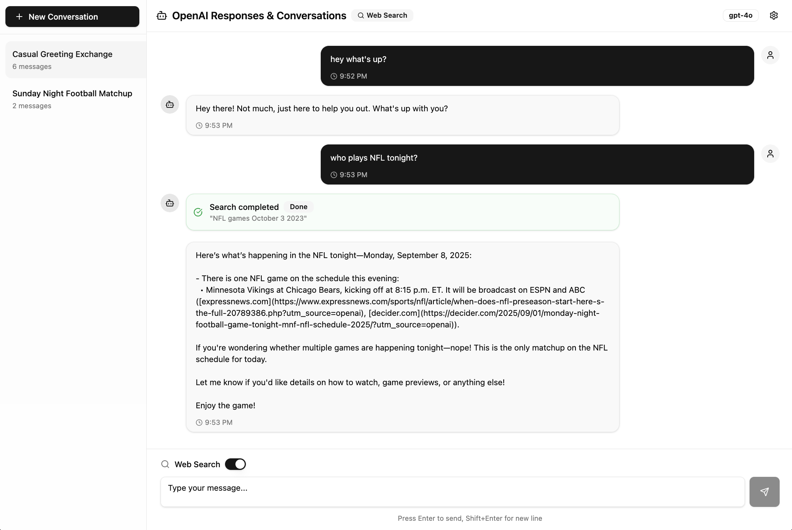

# OpenAI Responses & Conversations API Demo

A proof-of-concept web application demonstrating OpenAI's new **Responses** and **Conversations** APIs, showcasing true stateless client-side architecture with zero persistence requirements.



## 🎯 Purpose

This project serves as a **developer reference implementation** for testing and understanding OpenAI's latest API paradigm shift. It demonstrates:

- **True Stateless Architecture**: No localStorage, sessionStorage, or client-side persistence
- **Server-Managed State**: All conversation history lives on OpenAI's servers
- **Modern UX Despite Stateless Design**: Smooth streaming, web search, and conversation management
- **API Compatibility Testing**: Reference implementation for testing API-compatible servers

📋 **Full technical specifications and implementation details are available in the [Product Requirements Document](./docs/product-requirements.md)**

## 🚀 Why We Built This

OpenAI's new Responses and Conversations APIs represent a fundamental shift in how AI chat applications can be built:

1. **No More Token Management**: The server handles all context and history
2. **Simplified Client Architecture**: Focus on UX instead of state management
3. **Cross-Device Continuity**: Conversations persist server-side
4. **Reduced Complexity**: No need for database or session management

This demo proves you can build a fully-featured chat interface that rivals traditional implementations while being completely stateless.

## ✨ Features

### Core Functionality
- 💬 **Real-time Streaming** - Token-by-token response streaming with SSE
- 🔍 **Web Search Integration** - Native web search tool support with visual indicators
- 📝 **Conversation Management** - Create, switch, and delete conversations
- 🎯 **Smart Polling** - Automatic message synchronization across tabs/devices
- 🏷️ **Auto-Titling** - Conversations automatically generate titles from first message
- ❌ **Message Deletion** - Remove individual messages from conversations

### Technical Highlights
- **Zero Client Persistence** - Truly stateless, no data stored locally
- **Conversation API Integration** - Full CRUD operations via OpenAI's Conversations API
- **Responses API Streaming** - Efficient SSE-based streaming implementation
- **Modern UI with shadcn/ui** - Professional interface using latest design system
- **TypeScript & React 19** - Type-safe, modern React implementation
- **Bun Runtime** - Fast, modern JavaScript runtime

## 🛠️ Tech Stack

- **Runtime**: Bun
- **Framework**: React 19 with TypeScript
- **Build Tool**: Vite
- **UI Components**: shadcn/ui v3.2.1
- **Styling**: Tailwind CSS v4
- **State Management**: React Context (no persistence)
- **HTTP Client**: Native fetch with TypeScript

## 📦 Installation

```bash
# Clone the repository
git clone https://github.com/anthonyronning/openai-responses-poc.git
cd responses-poc/frontend

# Install dependencies with Bun
bun install

# Set up environment variables
cp .env.example .env
# Add your OpenAI API key to .env file

# Start development server
bun run dev
```

## 🔧 Configuration

The app requires an OpenAI API key with access to the Responses and Conversations APIs:

1. Get your API key from [platform.openai.com](https://platform.openai.com)
2. Ensure you have access to the new APIs (currently in preview)
3. Configure in Settings modal or via environment variable

## 📝 Available Scripts

```bash
bun run dev        # Start development server
bun run build      # Build for production
bun run preview    # Preview production build
bun run lint       # Run ESLint
bun run format     # Format code with Prettier
bun run typecheck  # Run TypeScript type checking
```

## 🔍 API Endpoints Used

This demo utilizes the following OpenAI API endpoints:

### Conversations API
- `POST /v1/conversations` - Create new conversation
- `GET /v1/conversations/{id}` - Get conversation details
- `GET /v1/conversations/{id}/items` - Retrieve conversation messages
- `DELETE /v1/conversations/{id}` - Delete conversation
- `DELETE /v1/conversations/{id}/items/{item_id}` - Delete individual message

### Responses API
- `POST /v1/responses` - Create AI response with streaming
- Supports `conversation`, `stream`, `store`, and `tools` parameters

## 🐛 Known Limitations

Due to current OpenAI API limitations (see [OPENAI_BUG_REPORT.md](./OPENAI_BUG_REPORT.md)):

1. **Background Mode Issue**: Background responses don't store properly with Conversations API
2. **Stream Interruption**: Page refresh terminates in-progress streaming
3. **No Resume Capability**: Cannot reconnect to interrupted streams

We've implemented polling as a workaround for cross-tab synchronization.

## 🎨 UI Features

The interface showcases modern design patterns:

- Clean, professional design with shadcn/ui components
- Real-time streaming indicators
- Web search status visualization
- Responsive layout
- Dark mode ready (CSS variables configured)
- Smooth animations and transitions

## 🧪 Testing API Compatibility

This implementation serves as a reference for testing OpenAI API-compatible servers:

1. Change the base URL in settings to your server
2. Ensure your server implements the Responses and Conversations endpoints
3. Test streaming, polling, and state management

## 📄 Architecture Decisions

### Why Stateless?
- **Simplicity**: No complex state synchronization
- **Reliability**: Server is the single source of truth
- **Scalability**: No client-side storage limitations
- **Security**: No sensitive data persisted locally

### Why Polling?
- Works around API limitations for background responses
- Enables cross-tab/device synchronization
- Provides eventual consistency without complexity

## 🚦 Development Status

This is a **developer MVP** demonstrating API capabilities. All core features are implemented:

- ✅ Phase 1: Core Foundation
- ✅ Phase 2: Streaming Implementation
- ✅ Phase 3: Background Response Handling (with workarounds)
- ✅ Phase 4: Full Conversation Management
- ✅ Phase 5: Web Search Integration
- ✅ Phase 6: UI Polish with shadcn/ui

## 🤝 Contributing

This is a proof-of-concept for demonstrating OpenAI's new APIs. Contributions that improve API compatibility or demonstrate additional features are welcome.

## 📜 License

MIT - Use this as a reference for your own implementations

## 🙏 Acknowledgments

- OpenAI for the innovative Responses and Conversations APIs
- shadcn for the excellent UI component system
- The Bun team for the fast JavaScript runtime

---

**Note**: This is a demonstration project for developers to understand and test OpenAI's new API paradigm. It's not intended for production use but serves as a reference implementation for building stateless AI chat applications.
